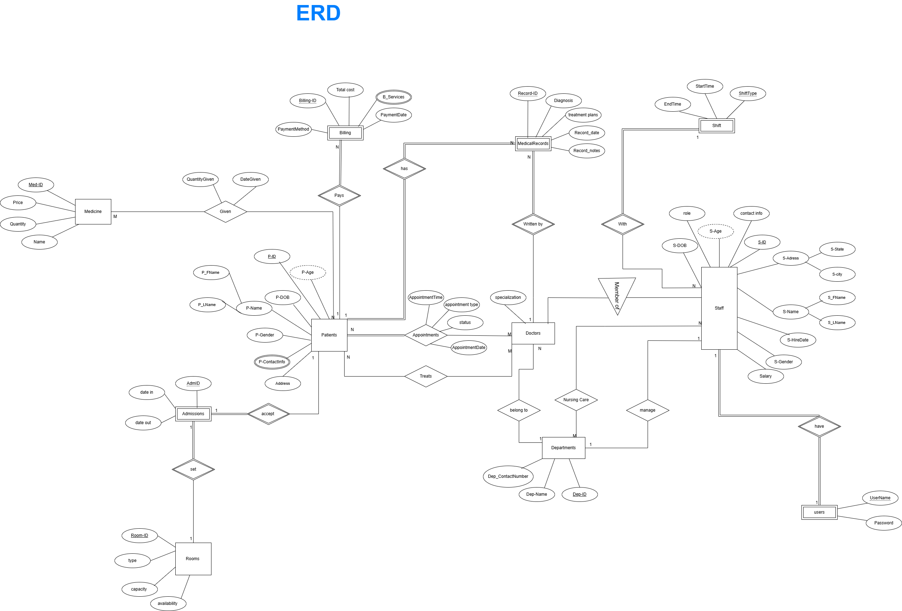
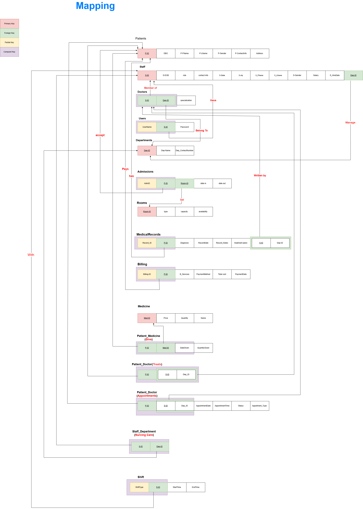
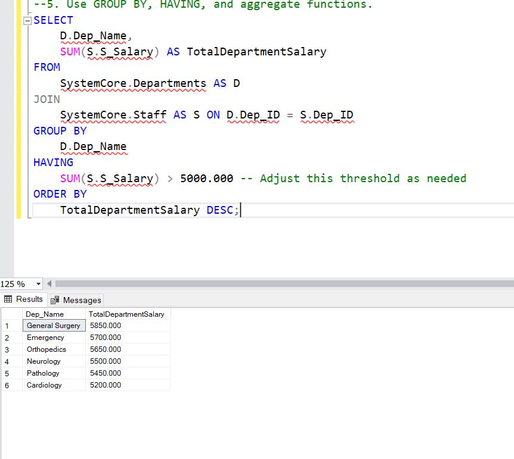
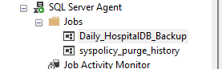

# Database Project Hospital Management System
## Required Database Objects
|Table| Description|
|------| ---------|
|Patients| Patient details: name, DOB, gender, contact info |
|Doctors| Doctor details: specialization, contact info |
|Departments| Department details:  cardiology, dermatology, etc.|
|Appointments| Appointment details: Links patients with doctors and a time |
|Admissions| Admission details: For in-patient stays: room number, date in/out |
|Rooms| Room details: Room number, type (ICU, general), availability |
|MedicalRecords| Diagnosis, treatment plans, date, notes|
|Billing| Total cost, patient ID, services, date|
|Staff| Staff details: Nurses, admin: role, shift, assigned dept |
|Users| User accounts: username, password, role (admin, doctor, nurse) |

## ER Diagram


## Mapping
 


## Normalization
 


## SQL Queries
### DDL (CREATION and AlTERATIONS STATEMENTS))
```sql
CREATE DATABASE HospitalDB -- create databse 

USE HospitalDB -- Make Sure User the script of HospitalSystem database 

-- drop database HospitalSystem -- To drop databse but make sure that dose currently use to be ability to delete

--============================ Create Tables ========================================

-- 1. Create Departments Table
-- Stores information about various departments in the hospital.
CREATE TABLE Departments (
    Dep_ID INT PRIMARY KEY IDENTITY(1,1), -- Primary Key, auto-incrementing by use "IDENTITY"
    Dep_Name NVARCHAR(100) NOT NULL UNIQUE, -- Department name, must be unique and not null
    Dep_ContactNumber NVARCHAR(20) -- Department contact number
);

-- 2. Create Staff Table
-- Stores information about general hospital staff (nurses, administration, etc.).
CREATE TABLE Staff (
    S_ID INT PRIMARY KEY IDENTITY(1,1), -- Primary Key, auto-incrementing
    S_FName VARCHAR(50) NOT NULL, -- Staff's first name, not null
    S_LName VARCHAR(50) NOT NULL, -- Staff's last name, not null
    Role VARCHAR(100) NOT NULL, -- Staff's role (e.g., Nurse, Administrator, Doctore), not null
    contactInfo VARCHAR(20) UNIQUE, -- Staff's contact number, must be unique if provided
    HireDate DATE NOT NULL DEFAULT GETDATE(), -- Date staff was hired, defaults to current date, not null
	S_Shift VARCHAR(10) NOT NULL, -- Staff's last name, not null
	S_Salary DECIMAL(8,3) CHECK(S_Salary > 350.000), -- Staff's Salary with check constrain to make sure salary should not be less than 350.000
	S_Gender VARCHAR(10) NOT NULL, -- Staff's Gender, not null
	S_State VARCHAR(10) NOT NULL, -- Staff's State, not null
	S_City VARCHAR(10) NOT NULL, -- Staff's City, not null
    Dep_ID INT, -- Foreign Key to Departments table
);

-- 3. Create Doctors Table
-- Stores Additional information about doctors
CREATE TABLE Doctors (
    Specialization VARCHAR(100) NOT NULL, -- Doctor's specialization, not null
    Dep_ID INT, -- Foreign Key to Departments table
	S_ID INT -- Foreign Key to Staff table
);

-- 4. Create Patients Table
-- Stores demographic information for patients.
CREATE TABLE Patients (
    P_ID INT PRIMARY KEY IDENTITY(1,1), -- Primary Key, auto-incrementing
    P_FName VARCHAR(50) NOT NULL, -- Patient's first name, not null
    P_LName VARCHAR(50) NOT NULL, -- Patient's last name, not null
    DBO DATE NOT NULL, -- Patient's date of birth, not null
    P_Gender VARCHAR(10) NOT NULL CHECK (P_Gender IN ('Male', 'Female')), -- Patient's gender, restricted to 'Male', 'Female', not null
    Address VARCHAR(100) -- Patient's address, optional
);

 -- 5. Create Patient Phone Number Table 
 -- Stores Phone Number for patients.

 CREATE tABLE p_ContactInfo(
 P_ID INT, -- Foreign Key to Patient table
 P_ContactInfo VARCHAR(20) Not Null-- Patient's contact number, 
 );


 -- 6. Create Users Table which include UaserNAme and PassWord for Everey Staff in the hospital 
 -- Stored Username and password 
 CREATE TABLE Users(
 Username VARCHAR(10) NOT NULL UNIQUE, --Partial Key User's Information, must be unique 
 S_ID INT NOT NULL, -- Foreign Key to Staff table
 Password VARCHAR(3) NOT NULL
 );

 --7. Create Admissions Table 
 -- Stored setting room information 

 CREATE TABLE Admissions
 (
 AdmID INT UNIQUE NOT NULL, -- Partial key, UNIQUE NUMBER OF EVERY ADMISSION 
 P_ID INT NOT NULL, -- Foreign Key to Patient table
 Room_ID INT NOT NULL, -- Foreign Key to Rooms table
 DateIN DATE NOT NULL DEFAULT GETDATE(), -- Date IN was admitted , defaults to current date, not null
 DateOut DATE NOT NULL -- DATE OUT NOT NULL 
 );


 -- 8. Create Rooms Table
 -- Stores details about rooms in the hospital.
CREATE TABLE Rooms (
    RoomID INT PRIMARY KEY IDENTITY(1,1), -- Primary Key, auto-incrementing
    RoomType VARCHAR(50) NOT NULL CHECK (RoomType IN ('Standard', 'Deluxe', 'ICU', 'Emergency', 'Operation Theater', 'Consultation')), -- Type of room, restricted values, not null
    Capacity INT NOT NULL CHECK (Capacity > 0), -- Maximum patient capacity of the room, must be greater than 0, not null
    Available  VARCHAR(10) DEFAULT 'TRUE' NOT NULL -- Room availability: by defualt is true, and not null

);

--9. Create MedicalRecords Table
-- Stores medical history, diagnosis, and treatment details for patients.
CREATE TABLE MedicalRecords (
    Record_ID INT Not null, -- Partial key, Not Null
    P_ID INT NOT NULL, -- Foreign Key to Patients table, not null
    s_ID INT NOT NULL, -- Foreign Key to Doctors table, not null
	Dep_ID INT NOT NULL, -- Foreign Key to Department table, not null
    Diagnosis VARCHAR(MAX) NOT NULL, -- Diagnosis, cannot be null
    Record_Notes VARCHAR(MAX), -- Treatment provided, optional THE WHY IT SOT SET AS NOT NULL 
    RecordDate DATETIME NOT NULL DEFAULT GETDATE(), -- Date and time the record was created, defaults to current datetime, not null
	Treatment_Plans NVARCHAR(MAX) -- Treatment provided, optional
);


--10. Create Biling table 
-- Records financial transactions related to patient services.
CREATE TABLE Biling (
    Biling_ID INT NOT NULL, -- Partial Key, Not null
    P_ID INT NOT NULL, -- Foreign Key to Patients table, not null
	B_Services VARCHAR(MAX) NOT NULL , --services information , not null 
    Total_Cost DECIMAL(10, 2) NOT NULL CHECK (Total_Cost >= 0), -- Payment amount, must be non-negative, not null
    PaymentDate DATETIME NOT NULL DEFAULT GETDATE(), -- Date and time of payment, defaults to current datetime, not null
    PaymentMethod NVARCHAR(50) NOT NULL CHECK (PaymentMethod IN ('Cash', 'Credit Card', 'Debit Card', 'Insurance', 'Bank Transfer')), -- Method of payment, restricted values, not null
);

--11. -- Create Medicine Table
-- Stores information about medicines available in the hospital pharmacy.
CREATE TABLE Medicine (
    MedID INT PRIMARY KEY IDENTITY(1,1), -- Primary Key, auto-incrementing
    Name NVARCHAR(100) NOT NULL UNIQUE, -- Name of the medicine, must be unique and not null
    Price DECIMAL(10, 2) NOT NULL CHECK (Price >= 0), -- Price of the medicine, must be non-negative, not null
    Quantity INT NOT NULL CHECK (Quantity >= 0) -- Quantity of the medicine in stock, must be non-negative, not null
);

-- 12. Create Patient_Medicine (Give) Table
-- This is a junction table to record which medicine is given to which patient.
-- Assumes PatientID and MedID refer to existing Patients and Medicine tables.
CREATE TABLE Patient_Medicine (
    P_ID INT NOT NULL, -- Foreign Key to Patients table
    MedID INT NOT NULL, -- Foreign Key to Medicine table
    QuantityGiven INT NOT NULL CHECK (QuantityGiven > 0), -- Quantity of medicine given to the patient, must be positive
    DateGiven DATETIME NOT NULL DEFAULT GETDATE(), -- Date and time the medicine was given, defaults to current datetime
    PRIMARY KEY (P_ID, MedID, DateGiven), -- Composite Primary Key to allow multiple records for same patient/medicine over time
    
);


-- 13. Create Patient_Doctor_Treats Table
-- This is a junction table to record which doctor treats which patient.
-- S_ID is likely StaffID or DoctorID; assuming DoctorID based on context.
-- Dep_ID is likely DepartmentID.
CREATE TABLE Patient_Doctor_Treats (
    P_ID INT NOT NULL, -- Foreign Key to Patients table
    S_ID INT NOT NULL, -- Foreign Key to Doctors table (assuming S_ID refers to DoctorID)
    Dep_ID INT NOT NULL, -- Foreign Key to Departments table (assuming Dep_ID refers to DepartmentID)
    PRIMARY KEY (P_ID, S_ID, Dep_ID) -- Composite Primary Key
);

-- -- 14. Create Patient_Doctor_Appointments_Log Table
-- Detailed log of patient appointments, similar to Appointments table but with more specific fields.
CREATE TABLE Patient_Doctor_Appointments (
    P_ID INT NOT NULL, -- Foreign Key to Patients table
    S_ID INT NOT NULL, -- Foreign Key to Doctors table (assuming S_ID refers to DoctorID)
    Dep_ID INT NOT NULL, -- Foreign Key to Departments table (assuming Dep_ID refers to DepartmentID)
    AppointmentDate DATE NOT NULL, -- Date of the appointment
    AppointmentTime TIME NOT NULL, -- Time of the appointment
    Status NVARCHAR(50) NOT NULL CHECK (Status IN ('Scheduled', 'Completed', 'Cancelled', 'Rescheduled')), -- Status of the appointment
    AppointmentType NVARCHAR(100), -- Type of appointment (e.g., 'Follow-up', 'New Consultation')
    PRIMARY KEY (P_ID, S_ID, Dep_ID, AppointmentDate, AppointmentTime), -- Composite Primary Key for unique appointment entries
    
);

--drop table Patient_Doctor_Appointments_Log

-- 15. Create Staff_Department (Nursing Care) Table
-- This is a junction table to record staff assignments to departments, especially for nursing care.
-- Assumes S_ID is StaffID.
CREATE TABLE Staff_Department_NursingCare(
    S_ID INT NOT NULL, -- Foreign Key to Staff table
    Dep_ID INT NOT NULL, -- Foreign Key to Departments table
    PRIMARY KEY (S_ID, Dep_ID), -- Composite Primary Key (a staff member can be assigned to a department)
    
);
--drop table Staff_Department
-- ================================= Foriegn Key  ========================

-- 1. linke between P_ContactInfo table and Patients Table 
alter table p_ContactInfo
Add CONSTRAINT FK_P_ContactInfo_Patiant FOREIGN KEY (P_ID) REFERENCES Patients(P_ID)
ON DELETE  NO ACTION
ON UPDATE CASCADE

-- 2. link between Staff table and department table 
alter table Staff
Add CONSTRAINT FK_Staff_Departments FOREIGN KEY (Dep_ID) REFERENCES Departments(Dep_ID)
ON DELETE  NO ACTION
ON UPDATE CASCADE

-- 3. linke between Staff and dector
alter table Doctors
Add CONSTRAINT FK_Doctors_Staff FOREIGN KEY (S_ID) REFERENCES Staff(S_ID)
ON DELETE NO ACTION 
ON UPDATE CASCADE

-- 4. link between doctor table and department table

alter table Doctors
Add CONSTRAINT FK_Doctors_Departments FOREIGN KEY (Dep_ID) REFERENCES Departments(Dep_ID)
ON DELETE NO ACTION
ON UPDATE NO ACTION


/*ALTER TABLE p_ContactInfo
      DROP  CONSTRAINT FK_Patiant_P_ContactInfo */

-- 5. link between users table and staff table 
alter table Users
Add CONSTRAINT FK_Users_staff FOREIGN KEY (S_ID) REFERENCES Staff(S_ID)
ON DELETE NO ACTION
ON UPDATE CASCADE

-- 6. linke between Admissions table and patiant table 
alter table Admissions
Add CONSTRAINT FK_Admissions_Patiant FOREIGN KEY (P_ID) REFERENCES Patients(P_ID)
ON DELETE CASCADE
ON UPDATE CASCADE

-- 7. linke bwtween Admissions table and room table
alter table Admissions
Add CONSTRAINT FK_Admissions_Room FOREIGN KEY (Room_ID) REFERENCES Rooms(RoomID)
ON DELETE CASCADE
ON UPDATE CASCADE

-- 8. linke between MedicalRecords table and patiant table
alter table MedicalRecords
Add CONSTRAINT FK_MedicalRecords_patiant FOREIGN KEY (P_ID) REFERENCES Patients(P_ID)
ON DELETE CASCADE
ON UPDATE CASCADE

-- 9. link between MedicalRecords table and doctor table
-- Modify the columns to be NOT NULL
ALTER TABLE Doctors
ALTER COLUMN Dep_ID INT NOT NULL;

ALTER TABLE Doctors
ALTER COLUMN S_ID INT NOT NULL;

-- Add primary key
ALTER TABLE Doctors
ADD PRIMARY KEY (S_ID, Dep_ID);


-- now can make link between MedicalRecords table and doctor table
alter table MedicalRecords
Add CONSTRAINT FK_MedicalRecords_doctor FOREIGN KEY (s_ID, Dep_ID) REFERENCES Doctors(S_ID, Dep_ID)
ON DELETE CASCADE
ON UPDATE CASCADE

-- 10. link between Billing table and patiant table
alter table Biling
Add CONSTRAINT FK_Billings_patiant FOREIGN KEY(P_ID) REFERENCES Patients(P_ID)
ON DELETE NO ACTION
ON UPDATE CASCADE

-- 11. link between Patient_Medicine (Give) table and patiant table
alter table Patient_Medicine
Add CONSTRAINT FK_Patient_Medicine_Give_patiant FOREIGN KEY(P_ID) REFERENCES Patients(P_ID)
ON DELETE CASCADE
ON UPDATE CASCADE

-- 12. link between Patient_Medicine (Give) table and Medicine table 
alter table Patient_Medicine
Add CONSTRAINT FK_Patient_Medicine_Give_Medicine FOREIGN KEY(MedID) REFERENCES Medicine(MedID)
ON DELETE CASCADE
ON UPDATE CASCADE

--13. link between Patient_Doctor(Treats) table and patiant table
alter table Patient_Doctor_Treats 
Add CONSTRAINT FK_Patient_Doctor_Treats_patiant FOREIGN KEY(P_ID) REFERENCES Patients(P_ID)
ON DELETE CASCADE
ON UPDATE CASCADE


-- 14. link between Patient_Doctor(Treats) table and Doctores table
alter table Patient_Doctor_Treats
Add CONSTRAINT FK_Patient_Doctor_Treats_Doctors FOREIGN KEY (s_ID, Dep_ID) REFERENCES Doctors(S_ID, Dep_ID)
ON DELETE CASCADE
ON UPDATE CASCADE

-- 15. link between Patient_Doctor(Appointment) table and doctor
alter table Patient_Doctor_Appointments  
Add CONSTRAINT FK_Patient_Doctor_Appointments_patiant FOREIGN KEY(P_ID) REFERENCES Patients(P_ID)
ON DELETE CASCADE
ON UPDATE CASCADE

-- 16. link between Patient_Doctor(Appointment) table and Doctores table
alter table Patient_Doctor_Appointments  
Add CONSTRAINT FK_Patient_Doctor_Appointments_Doctors FOREIGN KEY (s_ID, Dep_ID) REFERENCES Doctors(S_ID, Dep_ID)
ON DELETE CASCADE
ON UPDATE CASCADE


-- 17. link between Staff_Department_NursingCare table and sttaf table
alter table Staff_Department_NursingCare
Add CONSTRAINT FK_Staff_Department_NursingCare_staff FOREIGN KEY (S_ID) REFERENCES Staff(S_ID)
ON DELETE CASCADE
ON UPDATE CASCADE

-- 18. link between Staff_Department_NursingCare table and department table
alter table Staff_Department_NursingCare
Add CONSTRAINT FK_Staff_Department_NursingCare_Departments FOREIGN KEY (Dep_ID) REFERENCES Departments(Dep_ID)
ON DELETE NO ACTION
ON UPDATE NO ACTION


-- detele shilft column from staff table and created new table for shift data fot every staff
ALTER TABLE SystemCore.Staff
DROP COLUMN S_Shift;

-- create shift table 

CREATE TABLE dbo.Staff_Shift (
    ShiftName NVARCHAR(50) NOT NULL, -- Name of the shift (e.g., Morning, Evening, Night)
	S_ID INT NOT NULL,
    StartTime TIME NOT NULL, -- Start time of the shift
    EndTime TIME NOT NULL, -- End time of the shift
	primary key ( ShiftName, S_ID) -- composit key 
);

-- add the staff_shift table to Systemcore Schema
ALTER SCHEMA SystemCore TRANSFER dbo.Staff_Shift;

-- link staff_shift table with staff table 
alter table SystemCore.Staff_Shift
Add CONSTRAINT FK_staff_shift_Staff FOREIGN KEY (S_ID) REFERENCES SystemCore.Staff(S_ID)
ON DELETE NO ACTION
ON UPDATE NO ACTION


-- delete services column from billing table and create its sperete table called" Billing_Services"

ALTER TABLE PatientServices.Biling
DROP COLUMN B_Services;

-- create composite key for the billing table 
ALTER TABLE PatientServices.Biling
add primary key (Biling_ID, P_ID)

-- create table 
CREATE TABLE dbo.Billing_Services (
    B_Services Varchar(50) Not null,
	Biling_ID int Not null, -- foreign key for the primary key which represent as composite key in Billing table 
	P_ID INT NOT NULL -- foreign key for the primary key which represent as composite key in Billing table
);

-- add the staff_shift table to Systemcore Schema
ALTER SCHEMA PatientServices TRANSFER dbo.Billing_Services;

alter table PatientServices.Billing_Services
Add CONSTRAINT FK_Billing_Services_Billing FOREIGN KEY (Biling_ID, P_ID) REFERENCES PatientServices.Biling(Biling_ID, P_ID)
ON DELETE NO ACTION
ON UPDATE NO ACTION


```

### DML (INSERTION OF THE DATA)
```sql
USE HospitalDB;

-- 1. Inserting data into Departments Table (20 values)
INSERT INTO Departments (Dep_Name, Dep_ContactNumber) VALUES
('Cardiology', '96871234567'),
('Pediatrics', '96871234568'),
('Orthopedics', '96871234569'),
('Dermatology', '96871234570'),
('Neurology', '96871234571'),
('Oncology', '96871234572'),
('Emergency', '96871234573'),
('Radiology', '96871234574'),
('Pathology', '96871234575'),
('Pharmacy', '96871234576'),
('Physiotherapy', '96871234577'),
('General Surgery', '96871234578'),
('Internal Medicine', '96871234579'),
('Ophthalmology', '96871234580'),
('ENT', '96871234581'),
('Urology', '96871234582'),
('Gastroenterology', '96871234583'),
('Anesthesiology', '96871234584'),
('Psychiatry', '96871234585'),
('Nutrition and Dietetics', '96871234586');


-- 2. Inserting data into Rooms Table (20 values)
INSERT INTO Rooms (RoomType, Capacity, Available) VALUES
('Standard', 2, 'TRUE'),
('Deluxe', 1, 'TRUE'),
('ICU', 1, 'FALSE'),
('Emergency', 3, 'TRUE'),
('Operation Theater', 4, 'TRUE'), -- Capacity 0 for OT as it's a procedural room, not for staying
('Consultation', 1, 'TRUE'),
('Standard', 2, 'TRUE'),
('Deluxe', 1, 'FALSE'),
('ICU', 1, 'TRUE'),
('Emergency', 3, 'TRUE'),
('Consultation', 1, 'TRUE'),
('Standard', 2, 'TRUE'),
('Deluxe', 1, 'TRUE'),
('ICU', 1, 'FALSE'),
('Emergency', 3, 'TRUE'),
('Operation Theater', 4, 'TRUE'),
('Consultation', 1, 'TRUE'),
('Standard', 2, 'FALSE'),
('Deluxe', 1, 'TRUE'),
('Consultation', 1, 'TRUE');


-- 3. Inserting data into Medicine Table (20 values)
INSERT INTO Medicine (Name, Price, Quantity) VALUES
('Paracetamol 500mg', 0.50, 1000),
('Amoxicillin 250mg', 1.20, 500),
('Ibuprofen 400mg', 0.75, 800),
('Omeprazole 20mg', 2.10, 300),
('Cetirizine 10mg', 0.90, 600),
('Dextromethorphan Syrup', 3.50, 200),
('Metformin 500mg', 1.80, 450),
('Atorvastatin 10mg', 4.20, 250),
('Amlodipine 5mg', 2.50, 350),
('Sertraline 50mg', 5.00, 150),
('Ventolin Inhaler', 15.00, 100),
('Hydrocortisone Cream', 6.00, 200),
('Furosemide 40mg', 1.00, 300),
('Lisinopril 10mg', 2.70, 280),
('Diazepam 5mg', 3.00, 180),
('Warfarin 5mg', 7.50, 120),
('Insulin Glargine', 50.00, 50),
('Ciprofloxacin 500mg', 2.80, 400),
('Gabapentin 300mg', 3.20, 220),
('Prednisone 5mg', 1.50, 330);


-- 4. Inserting data into Patients Table (20 values)
INSERT INTO Patients (P_FName, P_LName, DBO, P_Gender, Address) VALUES
('Ahmed', 'Al Balushi', '1985-03-15', 'Male', 'Muscat, Al Khuwair'),
('Fatima', 'Al Hinai', '1992-07-22', 'Female', 'Sohar, Al Batinah'),
('Khalid', 'Al Rashdi', '1970-11-01', 'Male', 'Salalah, Dhofar'),
('Aisha', 'Al Habsi', '2000-01-20', 'Female', 'Nizwa, Ad Dakhiliyah'),
('Sultan', 'Al Maamari', '1965-05-30', 'Male', 'Sur, Sharqiyah South'),
('Mariam', 'Al Amri', '1998-09-10', 'Female', 'Muscat, Seeb'),
('Abdullah', 'Al Fazari', '1980-02-28', 'Male', 'Ibri, Ad Dhahirah'),
('Noora', 'Al Saidi', '1995-12-05', 'Female', 'Barka, Al Batinah South'),
('Mohammed', 'Al Kalbani', '1973-06-18', 'Male', 'Khasab, Musandam'),
('Hoor', 'Al Zadjali', '2005-04-03', 'Female', 'Muscat, Bowsher'),
('Said', 'Al Harthi', '1988-08-08', 'Male', 'Rustaq, Al Batinah South'),
('Salma', 'Al Shukaili', '1960-10-25', 'Female', 'Sohar, Al Azaiba'),
('Yousuf', 'Al Hasani', '1990-01-12', 'Male', 'Duqm, Al Wusta'),
('Zainab', 'Al Qasmi', '1978-03-01', 'Female', 'Samail, Ad Dakhiliyah'),
('Hamad', 'Al Jahwari', '1993-07-07', 'Male', 'Al Buraimi, Al Buraimi'),
('Sara', 'Al Shizawi', '2002-11-14', 'Female', 'Sohar, Al Hambar'),
('Nasser', 'Al Rawahi', '1982-04-29', 'Male', 'Muscat, Ghubrah'),
('Hind', 'Al Busaidi', '1975-09-02', 'Female', 'Nizwa, Tanuf'),
('Ali', 'Al Abri', '1997-06-21', 'Male', 'Salalah, Ittin'),
('Khulood', 'Al Farsi', '1968-12-19', 'Female', 'Sur, Bilad Sur');

-- 5. Inserting data into Staff Table (20 values)
-- Requires Dep_ID from Departments table (1-20)
ALTER TABLE Staff
ALTER COLUMN S_City VARCHAR(50);


INSERT INTO Staff (S_FName, S_LName, Role, contactInfo, HireDate, S_Shift, S_Salary, S_Gender, S_State, S_City, Dep_ID) VALUES
('Dr. Salim', 'Al Rashdi', 'Doctor', '96891112222', '2018-01-10', 'Morning', 2500.000, 'Male', 'Muscat', 'Bowsher', 1), -- Cardiology
('Nurse Fatma', 'Al Farsi', 'Nurse', '96891112223', '2019-03-15', 'Night', 850.000, 'Female', 'Muscat', 'Seeb', 2), -- Pediatrics
('Dr. Aisha', 'Al Hasani', 'Doctor', '96891112224', '2017-06-20', 'Morning', 2800.000, 'Female', 'Sohar', 'Al Batinah', 3), -- Orthopedics
('Admin Khalid', 'Al Amri', 'Administrator', '96891112225', '2020-01-05', 'Day', 900.000, 'Male', 'Muscat', 'Al Khuwair', 4), -- Dermatology
('Dr. Hamed', 'Al Habsi', 'Doctor', '96891112226', '2016-11-11', 'Morning', 2600.000, 'Male', 'Salalah', 'Dhofar', 5), -- Neurology
('Nurse Sara', 'Al Busaidi', 'Nurse', '96891112227', '2021-02-01', 'Evening', 950.000, 'Female', 'Nizwa', 'Ad Dakhiliyah', 6), -- Oncology
('Dr. Ali', 'Al Qasmi', 'Doctor', '96891112228', '2015-09-01', 'Morning', 3000.000, 'Male', 'Muscat', 'Muttrah', 7), -- Emergency
('Technician Maryam', 'Al Hinai', 'Radiology Technician', '96891112229', '2022-04-01', 'Day', 700.000, 'Female', 'Sur', 'Sharqiyah South', 8), -- Radiology
('Dr. Ahmed', 'Al Abri', 'Doctor', '96891112230', '2019-07-25', 'Morning', 2700.000, 'Male', 'Sohar', 'Al Batinah', 9), -- Pathology
('Pharmacist Noor', 'Al Zadjali', 'Pharmacist', '96891112231', '2020-05-10', 'Day', 1200.000, 'Female', 'Muscat', 'Al Amerat', 10), -- Pharmacy
('Physio Yousef', 'Al Mahrouqi', 'Physiotherapist', '96891112232', '2021-08-01', 'Day', 1000.000, 'Male', 'Ibri', 'Ad Dhahirah', 11), -- Physiotherapy
('Dr. Layla', 'Al Wahaibi', 'Doctor', '96891112233', '2017-03-05', 'Morning', 2900.000, 'Female', 'Muscat', 'Rusayl', 12), -- General Surgery
('Nurse Sultan', 'Al Balushi', 'Nurse', '96891112234', '2022-01-10', 'Morning', 800.000, 'Male', 'Barka', 'Al Batinah South', 13), -- Internal Medicine
('Dr. Nadia', 'Al Siyabi', 'Doctor', '96891112235', '2018-04-20', 'Morning', 2750.000, 'Female', 'Muscat', 'Qurum', 14), -- Ophthalmology
('Dr. Omar', 'Al Kindi', 'Doctor', '96891112236', '2016-10-01', 'Morning', 2850.000, 'Male', 'Khasab', 'Musandam', 15), -- ENT
('Nurse Hind', 'Al Maskari', 'Nurse', '96891112237', '2019-09-01', 'Evening', 900.000, 'Female', 'Muscat', 'Darsait', 16), -- Urology
('Dr. Abdullah', 'Al Shukaili', 'Doctor', '96891112238', '2017-02-14', 'Morning', 2950.000, 'Male', 'Muscat', 'Mawaleh', 17), -- Gastroenterology
('Nurse Mohammed', 'Al Harthi', 'Nurse', '96891112239', '2020-03-01', 'Night', 880.000, 'Male', 'Rustaq', 'Al Batinah South', 18), -- Anesthesiology
('Dr. Mona', 'Al Ghaithi', 'Doctor', '96891112240', '2018-05-20', 'Morning', 2650.000, 'Female', 'Muscat', 'Al Khoud', 19), -- Psychiatry
('Dietitian Amani', 'Al Ruqaishi', 'Dietitian', '96891112241', '2021-01-15', 'Day', 1100.000, 'Female', 'Muscat', 'Al Ghubrah', 20); -- Nutrition and Dietetics

Select * from Staff

-- 6. Inserting data into Doctors Table (20 values)
INSERT INTO Doctors (Specialization, Dep_ID, S_ID) VALUES
('Cardiologist', 1, 7),
('Pediatrician', 2, 9), -- Adjusted S_ID for a new doctor, assuming original Staff S_ID 3 is a doctor
('Orthopedic Surgeon', 3, 11), -- Adjusted S_ID
('Dermatologist', 4, 13), -- Adjusted S_ID
('Neurologist', 5, 15), -- Adjusted S_ID
('Oncologist', 6, 12), -- Adjusted S_ID
('Emergency Physician', 7, 14), -- Adjusted S_ID
('Radiologist', 8, 15), -- Adjusted S_ID
('Pathologist', 9, 17), -- Adjusted S_ID
('Internal Medicine Specialist', 13, 19); -- Adjusted S_ID

INSERT INTO Staff (S_FName, S_LName, Role, contactInfo, HireDate, S_Shift, S_Salary, S_Gender, S_State, S_City, Dep_ID) VALUES
('Dr. Jasim', 'Al Rawahi', 'Doctor', '96891112242', '2019-02-01', 'Morning', 2700.000, 'Male', 'Muscat', 'Azaiba', 1), -- Cardiology
('Dr. Badriya', 'Al Kindi', 'Doctor', '96891112243', '2020-08-10', 'Morning', 2600.000, 'Female', 'Sohar', 'Falaj', 2), -- Pediatrics
('Dr. Fahad', 'Al Maqbali', 'Doctor', '96891112244', '2017-05-12', 'Morning', 2850.000, 'Male', 'Nizwa', 'Firq', 3), -- Orthopedics
('Dr. Shatha', 'Al Saadi', 'Doctor', '96891112245', '2021-03-01', 'Morning', 2550.000, 'Female', 'Sur', 'Aseela', 4), -- Dermatology
('Dr. Tareq', 'Al Ismaili', 'Doctor', '96891112246', '2018-09-15', 'Morning', 2900.000, 'Male', 'Muscat', 'Mabellah', 5), -- Neurology
('Dr. Hajar', 'Al Balushi', 'Doctor', '96891112247', '2016-04-22', 'Morning', 3000.000, 'Female', 'Salalah', 'Saadah', 6), -- Oncology
('Dr. Yousra', 'Al Ghaithi', 'Doctor', '96891112248', '2022-01-01', 'Morning', 2700.000, 'Female', 'Muscat', 'Wadi Kabir', 7), -- Emergency
('Dr. Qais', 'Al Hashmi', 'Doctor', '96891112249', '2019-11-05', 'Morning', 2650.000, 'Male', 'Muscat', 'Ruwi', 8), -- Radiology
('Dr. Amal', 'Al Riami', 'Doctor', '96891112250', '2020-07-07', 'Morning', 2750.000, 'Female', 'Ibri', 'Al Dariz', 9), -- Pathology
('Dr. Ghanim', 'Al Hajri', 'Doctor', '96891112251', '2017-08-01', 'Morning', 2950.000, 'Male', 'Muscat', 'Al Hail', 12); -- General Surgery


INSERT INTO Doctors (Specialization, Dep_ID, S_ID) VALUES
('Cardiologist', 1, 21),
('Pediatrician', 2, 22),
('Orthopedic Surgeon', 3, 23),
('Dermatologist', 4, 24),
('Neurologist', 5, 25),
('Oncologist', 6, 26),
('Emergency Physician', 7, 27),
('Radiologist', 8, 28),
('Pathologist', 9, 29),
('General Surgeon', 12, 30);


-- 7. Inserting data into p_ContactInfo Table 
INSERT INTO p_ContactInfo (P_ID, P_ContactInfo) VALUES
(1, '96879000001'),
(2, '96879000002'),
(3, '96879000003'),
(4, '96879000004'),
(5, '96879000005'),
(6, '96879000006'),
(7, '96879000007'),
(8, '96879000008'),
(9, '96879000009'),
(10, '96879000010'),
(11, '96879000011'),
(12, '96879000012'),
(13, '96879000013'),
(14, '96879000014'),
(15, '96879000015'),
(16, '96879000016'),
(17, '96879000017'),
(18, '96879000018'),
(19, '96879000019'),
(20, '96879000020');


-- 8. Inserting data into Users Table (20 values)
INSERT INTO Users (Username, S_ID, Password) VALUES
('salim.r', 7, 'psw'),
('fatma.f', 8, 'psw'),
('aisha.h', 9, 'psw'),
('khalid.a', 10, 'psw'),
('hamed.h', 11, 'psw'),
('sara.b', 12, 'psw'),
('ali.q', 13, 'psw'),
('maryam.h', 14, 'psw'),
('ahmed.a', 15, 'psw'),
('noor.z', 16, 'psw'),
('yousef.m', 17, 'psw'),
('layla.w', 18, 'psw'),
('sultan.b', 19, 'psw'),
('nadia.s', 20, 'psw'),
('omar.k', 21, 'psw'),
('hind.m', 22, 'psw'),
('abd.s', 23, 'psw'),
('moh.h', 24, 'psw'),
('mona.g', 25, 'psw'),
('amani.r', 26, 'psw');


-- 9. Inserting data into Admissions Table (20 values)
--select * from Rooms
INSERT INTO Admissions (AdmID, P_ID, Room_ID, DateIN, DateOut) VALUES
(101, 1, 6, '2023-01-05', '2023-01-10'),
(102, 2, 7, '2023-01-07', '2023-01-12'),
(103, 3, 8, '2023-01-08', '2023-01-15'),
(104, 4, 9, '2023-01-10', '2023-01-11'),
(105, 5, 10, '2023-01-12', '2023-01-14'),
(106, 6, 11, '2023-01-15', '2023-01-18'),
(107, 7, 12, '2023-01-16', '2023-01-20'),
(108, 8, 13, '2023-01-18', '2023-01-25'),
(109, 9, 14, '2023-01-20', '2023-01-22'),
(110, 10, 15, '2023-01-22', '2023-01-23'),
(111, 11, 16, '2023-02-01', '2023-02-05'),
(112, 12, 17, '2023-02-03', '2023-02-08'),
(113, 13, 18, '2023-02-05', '2023-02-12'),
(114, 14, 19, '2023-02-07', '2023-02-09'),
(115, 15, 20, '2023-02-10', '2023-02-13'),
(116, 16, 3, '2023-02-12', '2023-02-16'),
(117, 17, 2, '2023-02-14', '2023-02-20'),
(118, 18, 1, '2023-02-16', '2023-02-17'),
(119, 19, 6, '2023-02-18', '2023-02-22'),
(120, 20, 7, '2023-02-20', '2023-02-25');

Select * from Staff

-- 10. Inserting data into MedicalRecords Table (20 values)
INSERT INTO MedicalRecords (Record_ID, P_ID, s_ID, Dep_ID, Diagnosis, Record_Notes, RecordDate, Treatment_Plans) VALUES
(2001, 1, 7, 1, 'Hypertension', 'Started ACE inhibitor. Monitor blood pressure daily.', '2023-03-01 09:30:00', 'Medication adjustment, lifestyle changes.'),
(2002, 2, 9, 2, 'Viral Gastroenteritis', 'Prescribed oral rehydration solution. Advised light diet.', '2023-03-02 11:00:00', 'Symptomatic treatment, hydration.'),
(2003, 3, 11, 3, 'Fractured Tibia', 'Cast applied. Follow-up in 4 weeks.', '2023-03-03 14:15:00', 'Immobilization, pain management.'),
(2004, 4, 12, 6, 'Eczema Flare-up', 'Topical corticosteroids prescribed. Avoid irritants.', '2023-03-04 10:45:00', 'Topical treatment, skin care advice.'),
(2005, 5, 13, 4, 'Migraine', 'Prescribed triptan. Advised to avoid triggers.', '2023-03-05 16:00:00', 'Acute migraine treatment, prevention strategies.'),
(2006, 6, 14, 7, 'Breast Cancer (Stage II)', 'Chemotherapy cycle 1 initiated. Monitor for side effects.', '2023-03-06 08:30:00', 'Chemotherapy, surgical consultation.'),
(2007, 7, 29, 9, 'Acute Appendicitis', 'Prepared for emergency appendectomy.', '2023-03-07 19:00:00', 'Surgical intervention.'),
(2008, 8, 15, 5, 'Pneumonia', 'Chest X-ray confirmed pneumonia. Started antibiotics.', '2023-03-08 12:00:00', 'Antibiotic therapy, respiratory support.'),
(2009, 9, 15, 8, 'Urinary Tract Infection', 'Urine culture positive for E. coli. Prescribed Ciprofloxacin.', '2023-03-09 10:10:00', 'Antibiotic treatment.'),
(2010, 10, 17, 9, 'Diabetes Mellitus Type 2', 'Started Metformin. Dietary counseling.', '2023-03-10 11:30:00', 'Medication, diet control.'),
(2011, 11, 19, 13, 'Coronary Artery Disease', 'Angiogram scheduled. Advised statin therapy.', '2023-03-11 09:00:00', 'Medication, diagnostic procedures.'),
(2012, 12, 21, 1, 'Bronchiolitis', 'Oxygen therapy. Monitored respiratory status.', '2023-03-12 13:00:00', 'Supportive care, hydration.'),
(2013, 13, 22, 2, 'Spinal Stenosis', 'Pain management and physiotherapy referral.', '2023-03-13 15:00:00', 'Pain relief, physical therapy.'),
(2014, 14, 23, 3, 'Psoriasis', 'UVB phototherapy started. Topical treatments continued.', '2023-03-14 10:00:00', 'Phototherapy, topical medication.'),
(2015, 15, 24, 4, 'Epilepsy', 'Adjusted antiepileptic medication dosage. Monitor for seizures.', '2023-03-15 14:30:00', 'Medication management.'),
(2016, 16, 25, 5, 'Colon Cancer', 'Referred for surgical resection.', '2023-03-16 09:45:00', 'Surgical treatment.'),
(2017, 17, 26, 6, 'Motor Vehicle Accident Injuries', 'Stabilized and transferred to ICU.', '2023-03-17 21:00:00', 'Emergency stabilization, critical care.'),
(2018, 18, 27, 7, 'Thyroid Nodule', 'Ultrasound and fine-needle aspiration performed.', '2023-03-18 11:15:00', 'Diagnostic workup.'),
(2019, 19, 28, 8, 'Anemia', 'Blood tests confirmed iron deficiency. Iron supplements prescribed.', '2023-03-19 09:30:00', 'Iron supplementation, dietary advice.'),
(2020, 20, 30, 12, 'Cholecystitis', 'Scheduled for laparoscopic cholecystectomy.', '2023-03-20 16:30:00', 'Surgical consultation.');


-- 11. Inserting data into Biling Table (20 values)
INSERT INTO Biling (Biling_ID, P_ID, B_Services, Total_Cost, PaymentDate, PaymentMethod) VALUES
(3001, 1, 'Consultation, Lab Tests, Medication', 150.75, '2023-03-01 10:00:00', 'Credit Card'),
(3002, 2, 'Consultation, Medication', 80.00, '2023-03-02 11:30:00', 'Cash'),
(3003, 3, 'Consultation, X-ray, Cast Application', 500.50, '2023-03-03 14:45:00', 'Insurance'),
(3004, 4, 'Consultation, Topical Cream', 75.20, '2023-03-04 11:00:00', 'Debit Card'),
(3005, 5, 'Consultation, Medication', 95.00, '2023-03-05 16:30:00', 'Cash'),
(3006, 6, 'Chemotherapy Session', 2500.00, '2023-03-06 09:00:00', 'Bank Transfer'),
(3007, 7, 'Emergency Visit, Surgery', 3500.00, '2023-03-07 20:00:00', 'Insurance'),
(3008, 8, 'Consultation, X-ray, Medication', 320.00, '2023-03-08 12:30:00', 'Credit Card'),
(3009, 9, 'Consultation, Lab Tests, Medication', 180.50, '2023-03-09 10:30:00', 'Debit Card'),
(3010, 10, 'Consultation, Lab Tests, Medication', 210.00, '2023-03-10 12:00:00', 'Cash'),
(3011, 11, 'Consultation, Lab Tests', 120.00, '2023-03-11 09:30:00', 'Credit Card'),
(3012, 12, 'Consultation, Oxygen Therapy', 90.00, '2023-03-12 13:30:00', 'Cash'),
(3013, 13, 'Consultation, Physiotherapy', 110.00, '2023-03-13 15:30:00', 'Insurance'),
(3014, 14, 'Consultation, Phototherapy', 130.00, '2023-03-14 10:30:00', 'Debit Card'),
(3015, 15, 'Consultation, Medication Adjustment', 85.00, '2023-03-15 15:00:00', 'Cash'),
(3016, 16, 'Surgical Consultation', 150.00, '2023-03-16 10:15:00', 'Bank Transfer'),
(3017, 17, 'Emergency Resuscitation', 4000.00, '2023-03-17 22:00:00', 'Insurance'),
(3018, 18, 'Consultation, Ultrasound', 280.00, '2023-03-18 11:45:00', 'Credit Card'),
(3019, 19, 'Consultation, Lab Tests, Supplements', 100.00, '2023-03-19 09:30:00', 'Debit Card'),
(3020, 20, 'Surgical Consultation', 160.00, '2023-03-20 17:00:00', 'Cash');


-- 12. Inserting data into Patient_Medicine Table (20 values)
INSERT INTO Patient_Medicine (P_ID, MedID, QuantityGiven, DateGiven) VALUES
(1, 1, 2, '2023-03-01 10:00:00'),
(2, 6, 1, '2023-03-02 11:30:00'),
(3, 3, 2, '2023-03-03 14:45:00'),
(4, 12, 1, '2023-03-04 11:00:00'),
(5, 5, 1, '2023-03-05 16:30:00'),
(6, 17, 1, '2023-03-06 09:00:00'),
(7, 18, 2, '2023-03-07 20:00:00'),
(8, 2, 2, '2023-03-08 12:30:00'),
(9, 18, 1, '2023-03-09 10:30:00'),
(10, 7, 1, '2023-03-10 12:00:00'),
(11, 8, 1, '2023-03-11 09:30:00'),
(12, 6, 1, '2023-03-12 13:30:00'),
(13, 3, 1, '2023-03-13 15:30:00'),
(14, 12, 1, '2023-03-14 10:30:00'),
(15, 5, 1, '2023-03-15 15:00:00'),
(16, 17, 1, '2023-03-16 10:15:00'),
(17, 18, 2, '2023-03-17 22:00:00'),
(18, 2, 1, '2023-03-18 11:45:00'),
(19, 1, 2, '2023-03-19 09:30:00'),
(20, 1, 1, '2023-03-20 17:00:00');


-- 13. Inserting data into Patient_Doctor_Treats Table (20 values)
--Select * from Doctors

INSERT INTO Patient_Doctor_Treats (P_ID, S_ID, Dep_ID) VALUES
(1, 7, 1),
(2, 9, 2),
(3, 11, 3),
(4, 12, 6),
(5, 13, 4),
(6, 14, 7),
(7, 15, 5),
(8, 15, 8),
(9, 17, 9),
(10, 19, 13),
(11, 21, 1),
(12, 22, 2),
(13, 23, 3),
(14, 24, 4),
(15, 25, 5),
(16, 26, 6),
(17, 27, 7),
(18, 28, 8),
(19, 29, 9),
(20, 30, 12);


-- 14. Inserting data into Patient_Doctor_Appointments Table (20 values)
--select * from Doctors

INSERT INTO Patient_Doctor_Appointments (P_ID, S_ID, Dep_ID, AppointmentDate, AppointmentTime, Status, AppointmentType) VALUES
(1, 7, 1, '2024-07-01', '10:00:00', 'Scheduled', 'Follow-up'),
(2, 9, 2, '2024-07-02', '11:00:00', 'Scheduled', 'New Consultation'),
(3, 11, 3, '2024-07-03', '14:00:00', 'Completed', 'Follow-up'),
(4, 12, 6, '2024-07-04', '09:30:00', 'Scheduled', 'Follow-up'),
(5, 13, 4, '2024-07-05', '15:00:00', 'Cancelled', 'New Consultation'),
(6, 14, 7, '2024-07-08', '08:00:00', 'Scheduled', 'Chemotherapy Review'),
(7, 15, 5, '2024-07-09', '18:00:00', 'Completed', 'Emergency Follow-up'),
(8, 15, 8, '2024-07-10', '10:30:00', 'Scheduled', 'New Consultation'),
(9, 17, 9, '2024-07-11', '11:00:00', 'Completed', 'Follow-up'),
(10, 19, 13, '2024-07-12', '13:00:00', 'Scheduled', 'Diet Consultation'),
(11, 21, 1, '2024-07-15', '09:00:00', 'Scheduled', 'Diagnostic Review'),
(12, 22, 2, '2024-07-16', '12:00:00', 'Scheduled', 'Check-up'),
(13, 23, 3, '2024-07-17', '14:30:00', 'Completed', 'Physiotherapy Referral'),
(14, 24, 4, '2024-07-18', '09:00:00', 'Rescheduled', 'Phototherapy Session'),
(15, 25, 5, '2024-07-19', '16:00:00', 'Scheduled', 'Medication Review'),
(16, 26, 6, '2024-07-22', '08:30:00', 'Scheduled', 'Surgical Consultation'),
(17, 27, 7, '2024-07-23', '20:00:00', 'Completed', 'Post-Op Check'),
(18, 28, 8, '2024-07-24', '11:00:00', 'Scheduled', 'Imaging Review'),
(19, 29, 9, '2024-07-25', '09:30:00', 'Completed', 'Lab Results Review'),
(20, 30, 12, '2024-07-26', '15:00:00', 'Scheduled', 'Pre-Op Consultation');


-- 15. Inserting data into Staff_Department_NursingCare Table (20 values)

INSERT INTO Staff_Department_NursingCare (S_ID, Dep_ID) VALUES
(7, 2), -- Nurse Fatma in Pediatrics
(8, 6), -- Nurse Sara in Oncology
(9, 8), -- Radiology Technician Maryam in Radiology
(10, 10), -- Pharmacist Noor in Pharmacy
(11, 11), -- Physio Yousef in Physiotherapy
(13, 13), -- Nurse Sultan in Internal Medicine
(16, 16), -- Nurse Hind in Urology
(18, 18), -- Nurse Mohammed in Anesthesiology
(20, 20), -- Dietitian Amani in Nutrition and Dietetics
(7, 1), -- Dr. Salim in Cardiology (can be assigned to a department for care oversight)
(9, 3), -- Dr. Aisha in Orthopedics
(10, 4), -- Admin Khalid in Dermatology
(11, 5), -- Dr. Hamed in Neurology
(7, 7), -- Dr. Ali in Emergency
(9, 9), -- Dr. Ahmed in Pathology
(12, 12), -- Dr. Layla in General Surgery
(14, 14), -- Dr. Nadia in Ophthalmology
(15, 15), -- Dr. Omar in ENT
(17, 17), -- Dr. Abdullah in Gastroenterology
(19, 19); -- Dr. Mona in Psychiatry

--Select * from SystemCore.Staff

INSERT INTO SystemCore.Staff_Shift(S_ID, ShiftName, StartTime, EndTime) VALUES
(7, 'Morning', '07:00:00', '15:00:00'),
(10, 'Evening', '15:00:00', '23:00:00'),
(11, 'Night', '23:00:00', '07:00:00'), 
(12, 'Morning', '07:00:00', '15:00:00'),
(8, 'Evening', '15:00:00', '23:00:00'),
(7, 'Night', '23:00:00', '07:00:00'), 
(13, 'Morning', '07:00:00', '15:00:00'),
(14, 'Evening', '15:00:00', '23:00:00'),
(10, 'Night', '23:00:00', '07:00:00'), 
(15, 'Morning', '07:00:00', '15:00:00'),
(16, 'Evening', '15:00:00', '23:00:00'),
(13, 'Night', '23:00:00', '07:00:00');

-- inseration satement to Billing_Services table 
INSERT INTO PatientServices.Billing_Services (B_Services, Biling_ID, P_ID) VALUES
('Consultation', 3001, 1),
('Lab Tests', 3001, 1),
('Medication', 3001, 1),
('Consultation', 3002, 2),
('Medication', 3002, 2),
('X-ray', 3003, 3),
('Cast Application', 3003, 3),
('Topical Cream', 3004, 4),
('Consultation', 3005, 5),
('Chemotherapy Session', 3006, 6),
('Emergency Visit', 3007, 7),
('Surgery', 3007, 7),
('Consultation', 3008, 8),
('X-ray', 3008, 8),
('Lab Tests', 3009, 9),
('Consultation', 3010, 10),
('Oxygen Therapy', 3012, 12),
('Physiotherapy', 3013, 13),
('Phototherapy', 3014, 14),
('Surgical Consultation', 3020, 20);

```

### Relation Schema
```sql

USE HospitalDB;


-- 1. Create Core System Schema
-- This schema will contain foundational tables related to hospital administration and general staff.
CREATE SCHEMA SystemCore;

-- Transfer tables to SystemCore schema
ALTER SCHEMA SystemCore TRANSFER dbo.Departments;
ALTER SCHEMA SystemCore TRANSFER dbo.Staff;
ALTER SCHEMA SystemCore TRANSFER dbo.Users;

-- 2. Create Doctors and Medical Records Schema
-- This schema will group tables primarily related to doctors, their specializations, and patient medical records.
CREATE SCHEMA MedicalManagement;


-- Transfer tables to MedicalManagement schema
ALTER SCHEMA MedicalManagement TRANSFER dbo.Doctors;
ALTER SCHEMA MedicalManagement TRANSFER dbo.MedicalRecords;
ALTER SCHEMA MedicalManagement TRANSFER dbo.Patient_Doctor_Treats;
ALTER SCHEMA MedicalManagement TRANSFER dbo.Patient_Doctor_Appointments;


-- 3. Create Patients and Billing Schema
-- This schema will contain tables related to patient demographics, contact information, admissions, and billing.
CREATE SCHEMA PatientServices;


-- Transfer tables to PatientServices schema
ALTER SCHEMA PatientServices TRANSFER dbo.Patients;
ALTER SCHEMA PatientServices TRANSFER dbo.p_ContactInfo;
ALTER SCHEMA PatientServices TRANSFER dbo.Admissions;
ALTER SCHEMA PatientServices TRANSFER dbo.Biling;
ALTER SCHEMA PatientServices TRANSFER dbo.Patient_Medicine;


-- 4. Create Resources and Inventory Schema
-- This schema will manage hospital resources like rooms and medicine inventory.
CREATE SCHEMA HospitalResources;


-- Transfer tables to HospitalResources schema
ALTER SCHEMA HospitalResources TRANSFER dbo.Rooms;
ALTER SCHEMA HospitalResources TRANSFER dbo.Medicine;


-- 5. Create Nursing Care Schema
-- This schema specifically addresses staff assignments for nursing care.
CREATE SCHEMA NursingCare;


-- Transfer tables to NursingCare schema
ALTER SCHEMA NursingCare TRANSFER dbo.Staff_Department_NursingCare;


```

### Queries to Test (DQL)
1. List all patients who visited a certain doctor.
```
 SELECT
    P.P_ID,
    P.P_FName,
    P.P_LName,
    P.DBO,
    P.P_Gender,
    P.Address
FROM
    PatientServices.Patients AS P
JOIN
    MedicalManagement.Patient_Doctor_Treats AS PDT ON P.P_ID = PDT.P_ID
JOIN
    MedicalManagement.Doctors AS D ON PDT.S_ID = D.S_ID AND PDT.Dep_ID = D.Dep_ID
JOIN
    SystemCore.Staff AS S ON D.S_ID = S.S_ID
WHERE
    S.S_FName = 'Dr. Salim' AND S.S_LName = 'Al Rashdi';

```


2. Count of appointments per department. 
```
SELECT
    D.Dep_Name,
    COUNT(PDA.P_ID) AS NumberOfAppointments
FROM
    SystemCore.Departments AS D
JOIN
    MedicalManagement.Patient_Doctor_Appointments AS PDA ON D.Dep_ID = PDA.Dep_ID
GROUP BY
    D.Dep_Name
ORDER BY
    NumberOfAppointments DESC;

```


3. Retrieve doctors who have more than 5 appointments in a month. 
```
SELECT
    S.S_FName,
    S.S_LName,
    D.Specialization,
    COUNT(PDA.P_ID) AS TotalAppointments
FROM
    SystemCore.Staff AS S
JOIN
    MedicalManagement.Doctors AS D ON S.S_ID = D.S_ID
JOIN
    MedicalManagement.Patient_Doctor_Appointments AS PDA ON D.S_ID = PDA.S_ID AND D.Dep_ID = PDA.Dep_ID
WHERE
    FORMAT(PDA.AppointmentDate, 'yyyy-MM') = '2024-07' -- Filter for a specific month
GROUP BY
    S.S_FName,
    S.S_LName,
    D.Specialization
HAVING
    COUNT(PDA.P_ID) >=1
ORDER BY
    TotalAppointments DESC;

```


4. Use JOINs across 3–4 tables.
```SQL
SELECT
    P.P_FName,
    P.P_LName,
    A.DateIN,
    R.RoomType,
    R.RoomID
FROM
    PatientServices.Patients AS P
JOIN
    PatientServices.Admissions AS A ON P.P_ID = A.P_ID
JOIN
    HospitalResources.Rooms AS R ON A.Room_ID = R.RoomID
WHERE
    R.Available = 'FALSE'; -- Assuming 'FALSE' means currently occupied

```


5. Use GROUP BY, HAVING, and aggregate functions. 
``` SQL
SELECT
    D.Dep_Name,
    SUM(S.S_Salary) AS TotalDepartmentSalary
FROM
    SystemCore.Departments AS D
JOIN
    SystemCore.Staff AS S ON D.Dep_ID = S.Dep_ID
GROUP BY
    D.Dep_Name
HAVING
    SUM(S.S_Salary) > 5000.000 -- Adjust this threshold as needed
ORDER BY
    TotalDepartmentSalary DESC;
```


6. Use SUBQUERIES and EXISTS.  (This query identifies the first and last names and specialty of physicians who have been diagnosed with high blood pressure.)
``` SQL
SELECT
    S.S_FName,
    S.S_LName,
    D.Specialization
FROM
    SystemCore.Staff AS S
JOIN
    MedicalManagement.Doctors AS D ON S.S_ID = D.S_ID
WHERE D.S_ID IN (
    SELECT MR.s_ID
    FROM MedicalManagement.MedicalRecords AS MR
    WHERE MR.Diagnosis = 'Hypertension'
);

```


###  Functions & Stored Procedures 
1. Scalar function to calculate patient age from DOB.
```sql

-- Description: Calculates the age of a patient based on their Date of Birth (DOB).
-- Parameters:
--   @DateOfBirth DATE: The patient's date of birth.
-- Returns: INT (The calculated age in years).
-- Example Usage: SELECT dbo.fn_CalculatePatientAge('1990-05-15');
CREATE FUNCTION dbo.fn_CalculatePatientAge (@DateOfBirth DATE)
RETURNS INT
AS
BEGIN
    DECLARE @Age INT;

    -- Calculate age by subtracting birth year from current year.
    -- Then, adjust if the birthday hasn't occurred yet this year.
    SET @Age = DATEDIFF(year, @DateOfBirth, GETDATE());

    IF MONTH(@DateOfBirth) > MONTH(GETDATE()) OR
       (MONTH(@DateOfBirth) = MONTH(GETDATE()) AND DAY(@DateOfBirth) > DAY(GETDATE()))
    BEGIN
        SET @Age = @Age - 1;
    END

    RETURN @Age;
END;

-- test
SELECT
    P.P_FName,
    P.P_LName,
    P.DBO,
    dbo.fn_CalculatePatientAge(P.DBO) AS Age
FROM
    PatientServices.Patients AS P;

-- IF WE HAVE STORED PROCEDURE WITH NO TABLE
Declare @Age Int;
exec dbo.fn_CalculatePatientAge '1998/08/09', @Age OUTPUT;
SELECT @Age;

-- IF WE HAVE FUNCTION WITH NO TABLE
Declare @Age Int;
SET @Age = dbo.fn_CalculatePatientAge('1998/08/08'); -- Call the function and assign its return value
SELECT @Age;

```


2. Stored procedure to admit a patient (insert to Admissions, update Room availability).
``` sql
-- Description: Admits a patient to a room, updating room availability.
-- Parameters:
--   @P_ID INT: The Patient ID.
--   @Room_ID INT: The Room ID where the patient will be admitted.
--   @DateOut DATE: The expected or actual date of discharge.
--   @AdmissionID INT OUTPUT: Outputs the newly generated Admission ID.
-- Remarks:
--   - This procedure checks if the room is available before admitting.
--   - The AdmID is generated here using MAX(AdmID) + 1 for simplicity. In a real system,
--     consider using a sequence object for robust ID generation.
-- Example Usage:
--   DECLARE @newAdmID INT;
--   EXEC dbo.sp_AdmitPatient @P_ID = 1, @Room_ID = 1, @DateOut = '2025-07-05', @AdmissionID = @newAdmID OUTPUT;
--   SELECT @newAdmID AS NewAdmissionID;
-- =======================================================
CREATE PROCEDURE dbo.sp_AdmitPatient
(
    @P_ID INT,
    @Room_ID INT,
    @DateOut DATE,
    @AdmissionID INT OUTPUT
)
AS
BEGIN
    SET NOCOUNT ON;

    -- Declare variables with appropriate data types
    DECLARE @RoomAvailabilityStatus VARCHAR(10); -- Renamed for clarity
    DECLARE @MaxAdmID INT;
    DECLARE @CurrentPatientsInRoom INT; -- Renamed for clarity
    DECLARE @RoomCapacity INT;          -- Renamed for clarity

    BEGIN TRY
        -- Check if the Room_ID exists and get its availability status and capacity
        SELECT
            @RoomAvailabilityStatus = R.Available,
            @RoomCapacity = R.Capacity
        FROM
            HospitalResources.Rooms AS R
        WHERE
            R.RoomID = @Room_ID;

        -- Handle case where Room_ID does not exist
        IF @RoomAvailabilityStatus IS NULL
        BEGIN
            SET @AdmissionID = -1; -- Indicate room not found
            PRINT 'Error: Room ID ' + CAST(@Room_ID AS NVARCHAR(10)) + ' does not exist.';
            RETURN; -- Exit the procedure
        END

        -- Count the current number of patients admitted to this room
        -- Only count active admissions (where DateOut is in the future or NULL)
        SELECT
            @CurrentPatientsInRoom = COUNT(AdmID)
        FROM
            PatientServices.Admissions
        WHERE
            Room_ID = @Room_ID
            AND (DateOut IS NULL OR DateOut > GETDATE()); -- Assuming DateOut marks the end of admission

        -- Determine if the room has space
        IF @CurrentPatientsInRoom < @RoomCapacity
        BEGIN
            -- Generate a new unique Admission ID
            SELECT @MaxAdmID = ISNULL(MAX(AdmID), 0) FROM PatientServices.Admissions; -- Start from 0 to ensure first ID is 1
            SET @AdmissionID = @MaxAdmID + 1;

            -- Insert into Admissions table
            INSERT INTO PatientServices.Admissions (AdmID, P_ID, Room_ID, DateIN, DateOut)
            VALUES (@AdmissionID, @P_ID, @Room_ID, GETDATE(), @DateOut);

            -- Update Room availability based on new patient count
            IF (@CurrentPatientsInRoom + 1) >= @RoomCapacity -- Check if the room becomes full AFTER this admission
            BEGIN
                UPDATE HospitalResources.Rooms
                SET Available = 'FALSE'
                WHERE RoomID = @Room_ID;
            END
            ELSE
            BEGIN
                -- Ensure it's marked TRUE if there's still capacity
                UPDATE HospitalResources.Rooms
                SET Available = 'TRUE'
                WHERE RoomID = @Room_ID;
            END

            PRINT 'Patient admitted successfully. Admission ID: ' + CAST(@AdmissionID AS NVARCHAR(10));
        END
        ELSE
        BEGIN
            SET @AdmissionID = -1; -- Indicate admission failure: Room is full or not available
            PRINT 'Error: Room ' + CAST(@Room_ID AS NVARCHAR(10)) + ' is currently full.';
        END
    END TRY
    BEGIN CATCH
        -- Handle errors
        PRINT 'An error occurred during patient admission: ' + ERROR_MESSAGE();
        SET @AdmissionID = -1; -- Indicate admission failure
    END CATCH
END;
GO

-- test 
-- First: Defining the variable that will hold the resulting ID value
DECLARE @NewAdmissionID INT;

-- Second: Call the stored procedure and pass the variable as output
EXEC dbo.sp_AdmitPatient
    @P_ID = 1,              --This patient must be pre-existing.
    @Room_ID = 19,         -- Room currently available (Available = 'TRUE')
    @DateOut = '2025-07-10',
    @AdmissionID = @NewAdmissionID OUTPUT;

--Third: Display the resulting ID value
SELECT @NewAdmissionID AS NewAdmissionID; -- -1 Unseccuseeful inseart in admiss

```


3. Procedure to generate invoice (insert into Billing based on treatments). 
```sql
-- Description: Generates a billing invoice for a patient based on treatments and total cost.
-- Parameters:
--   @P_ID INT: The Patient ID for whom the invoice is being generated.
--   @Services NVARCHAR(MAX): A description of the services provided.
--   @Total_Cost DECIMAL(10, 2): The total cost of the services.
--   @PaymentMethod NVARCHAR(50): The method of payment (e.g., 'Cash', 'Credit Card').
--   @BillingID INT OUTPUT: Outputs the newly generated Billing ID.
-- Remarks:
--   - Assumes Biling_ID is NOT NULL but not IDENTITY in your table structure.
--     If Biling_ID is IDENTITY, remove it from the INSERT and output SCOPE_IDENTITY().
--   - Biling_ID is generated using MAX(Biling_ID) + 1 for simplicity.
-- Example Usage:
--   DECLARE @newBillID INT;
--   EXEC dbo.sp_GenerateInvoice @P_ID = 1, @Services = 'Routine Checkup, Lab Tests',
--                               @Total_Cost = 250.75, @PaymentMethod = 'Credit Card',
--                               @BillingID = @newBillID OUTPUT;
--   SELECT @newBillID AS NewBillingID;
-- =======================================================
--SELECT *FROM PatientServices.Biling
CREATE PROCEDURE dbo.sp_GenerateInvoice
    @P_ID INT,
    @Services NVARCHAR(MAX),
    @Total_Cost DECIMAL(10, 2),
    @PaymentMethod NVARCHAR(50),
    @BillingID INT OUTPUT
AS
BEGIN
    DECLARE @MaxBillingID INT;

    BEGIN TRY
        -- Generate a new unique Billing ID
        SELECT @MaxBillingID = ISNULL(MAX(Biling_ID), 3000) FROM PatientServices.Biling;
        SET @BillingID = @MaxBillingID + 1;

        -- Insert into Biling table
        INSERT INTO PatientServices.Biling (Biling_ID, P_ID, B_Services, Total_Cost, PaymentDate, PaymentMethod)
        VALUES (@BillingID, @P_ID, @Services, @Total_Cost, GETDATE(), @PaymentMethod);

        PRINT 'Invoice generated successfully. Billing ID: ' + CAST(@BillingID AS NVARCHAR(10)); -- CAST: It is a function used to convert a data type from one type to another.
    END TRY
    BEGIN CATCH
        -- Handle errors
        PRINT 'An error occurred during invoice generation: ' + ERROR_MESSAGE();
        SET @BillingID = -1; -- Indicate failure
    END CATCH
END;
GO

```


4. Procedure to assign doctor to department and shift. 
```sql
-- Description: Assigns or updates a doctor's primary working department and shift.
-- Parameters:
--   @S_ID INT: The Staff ID of the doctor.
--   @NewDep_ID INT: The ID of the new department to assign the doctor to.
--   @NewShift VARCHAR(10): The new shift for the doctor (e.g., 'Morning', 'Evening', 'Night').
-- Remarks:
--   - This procedure updates the Staff table only. If a doctor's primary
--     specialization department in the Doctors table needs to change,
--     that would require additional logic (e.g., deleting and re-inserting
--     into the Doctors table, or updating if Specialization allows multiple entries).
--     This procedure assumes Staff.Dep_ID tracks their current working assignment.
-- Example Usage: EXEC dbo.sp_AssignDoctorToDepartmentAndShift @S_ID = 1, @NewDep_ID = 2, @NewShift = 'Evening';
-- =======================================================
CREATE PROCEDURE dbo.sp_AssignDoctorToDepartmentAndShift
    @S_ID INT,
    @NewDep_ID INT,
    @NewShift VARCHAR(10),
    @SetStartTime Time,
    @SetEndTime Time
AS
BEGIN
    BEGIN TRY
        -- Debugging: Print received parameters
        PRINT 'Parameters received: S_ID=' + CAST(@S_ID AS NVARCHAR(10)) +
              ', NewDep_ID=' + CAST(@NewDep_ID AS NVARCHAR(10)) +
              ', NewShift=' + @NewShift +
              ', StartTime=' + CONVERT(NVARCHAR(8), @SetStartTime, 108) +
              ', EndTime=' + CONVERT(NVARCHAR(8), @SetEndTime, 108);

        -- Check if the Staff ID exists and belongs to a 'Doctor' role
        IF EXISTS (SELECT 1 FROM SystemCore.Staff WHERE S_ID = @S_ID)
        BEGIN
            PRINT 'S_ID ' + CAST(@S_ID AS NVARCHAR(10)) + ' found and is a Doctor.';
            -- Check if the NewDep_ID is a valid department
            IF EXISTS (SELECT 1 FROM SystemCore.Departments WHERE Dep_ID = @NewDep_ID)
            BEGIN
                PRINT 'Dep_ID ' + CAST(@NewDep_ID AS NVARCHAR(10)) + ' is valid.';

                -- Update the doctor's department in Staff table
                UPDATE SystemCore.Staff
                SET
                    Dep_ID = @NewDep_ID
                WHERE
                    S_ID = @S_ID;
                PRINT 'Staff table updated. Rows affected: ' + CAST(@@ROWCOUNT AS NVARCHAR(10));

                -- Inseart The doctor's shift in the Staff_Shift table
				INSERT INTO SystemCore.Staff_Shift (ShiftName, S_ID, StartTime, EndTime)VALUES (@NewShift, @S_ID, @SetStartTime, @SetEndTime);


                PRINT 'Staff_Shift table Inseart.'

                -- print this message to the user
                PRINT 'Doctor ' + CAST(@S_ID AS NVARCHAR(10)) + ' assigned to Department ID ' +
                      CAST(@NewDep_ID AS NVARCHAR(10)) + ' and ' + @NewShift + ' from ' +
                      CONVERT(NVARCHAR(8), @SetStartTime, 108) + ' to ' +
                      CONVERT(NVARCHAR(8), @SetEndTime, 108) +' shift successfully.';
            END
            ELSE
            BEGIN
                PRINT 'Error: New Department ID ' + CAST(@NewDep_ID AS NVARCHAR(10)) + ' does not exist.';
            END
        END
        ELSE
        BEGIN
            PRINT 'Error: Staff ID ' + CAST(@S_ID AS NVARCHAR(10)) + ' does not exist or is not a doctor.';
        END
    END TRY
    BEGIN CATCH
        -- Handle errors
        PRINT 'An error occurred during doctor assignment: ' + ERROR_MESSAGE();
        PRINT 'Error Line: ' + CAST(ERROR_LINE() AS NVARCHAR(10));
        PRINT 'Error State: ' + CAST(ERROR_STATE() AS NVARCHAR(10));
        PRINT 'Error Severity: ' + CAST(ERROR_SEVERITY() AS NVARCHAR(10));
    END CATCH
END;
GO

select * from SystemCore.Staff
Select * from SystemCore.Staff_Shift

Go 

EXEC dbo.sp_AssignDoctorToDepartmentAndShift
    @S_ID = 7, -- Replace with actual S_ID
    @NewDep_ID = 1, -- Replace with actual Department ID
    @NewShift = 'Evening', -- Replace with actual shift name
    @SetStartTime = '08:00:00',
    @SetEndTime = '16:00:00';
Go 

select * from SystemCore.Staff
Select * from SystemCore.Staff_Shift
```


### Triggers
1. After insert on Appointments → auto log in MedicalRecords. 
```sql
-- Fires AFTER an INSERT operation on the Patient_Doctor_Appointments table.
-- Automatically creates a new entry in the MedicalRecords table to log the appointment.
-- This provides a basic audit trail or initial record for each appointment.
-- =======================================================

CREATE TRIGGER trg_Appointments_AutoLogMedicalRecords
ON MedicalManagement.Patient_Doctor_Appointments
AFTER INSERT
AS
BEGIN
    -- For each new appointment inserted, create a corresponding medical record entry.
    INSERT INTO MedicalManagement.MedicalRecords (
        Record_ID,
        P_ID,
        s_ID,
        Dep_ID,
        Diagnosis,
        Record_Notes,
        RecordDate,
        Treatment_Plans
    )
    SELECT
        -- Generate a new Record_ID 
        ISNULL((SELECT MAX(Record_ID) FROM MedicalManagement.MedicalRecords), 2000) + ROW_NUMBER() OVER (ORDER BY I.P_ID),
        I.P_ID,
        I.S_ID,
        I.Dep_ID,
        'Initial Appointment Log', -- Generic diagnosis for auto-log
        'Auto-generated log for new appointment on ' + CONVERT(NVARCHAR(20), I.AppointmentDate, 101) + ' at ' + CONVERT(NVARCHAR(20), I.AppointmentTime, 108) + '.',
        GETDATE(), -- Record date is now
        'Follow-up/Diagnosis Pending' -- Generic treatment plan
    FROM
        INSERTED AS I;

    PRINT 'Trigger [trg_Appointments_AutoLogMedicalRecords] executed: Medical record(s) logged for new appointment(s).';
END;

-- Test

-- Example 1: Inserting a new appointment for Patient ID 1, Doctor S_ID 1, Department ID 1
-- (Ensure P_ID=1 exists in Patients, and (S_ID=1, Dep_ID=1) exists in Doctors)
INSERT INTO PatientServices.Patients (P_FName, P_LName, DBO, P_Gender, Address) VALUES
('Ali', 'Al Balushi', '1985-03-15', 'Male', 'Muscat, Al Khuwair')

INSERT INTO MedicalManagement.Patient_Doctor_Appointments (P_ID, S_ID, Dep_ID, AppointmentDate, AppointmentTime, Status, AppointmentType)
VALUES (21, 7, 1, '2024-08-01', '09:00:00', 'Scheduled', 'General Checkup');
GO

Select * from PatientServices.Patients

Select * from MedicalManagement.MedicalRecords

```


2. Before delete on Patients → prevent deletion if pending bills exist.
```sql
CREATE TRIGGER trg_Patients_PreventDeleteIfPendingBills
ON PatientServices.Patients
INSTEAD OF DELETE
AS
BEGIN

    -- Check if any patient being deleted has bills with a Total_Cost greater than 0
    IF EXISTS (
        SELECT 1
        FROM DELETED AS D
        JOIN PatientServices.Biling AS B ON D.P_ID = B.P_ID
        WHERE B.Total_Cost > 0
    )
    BEGIN
        -- If found, raise an error and stop the deletion
        RAISERROR('Cannot delete patient(s). One or more patients have pending billing records (Total_Cost > 0).', 16, 1);
        ROLLBACK TRANSACTION;
    END
    ELSE
    BEGIN
        -- If no pending bills, proceed with the actual delete for all patients in the batch
        DELETE FROM PatientServices.Patients
        WHERE P_ID IN (SELECT P_ID FROM DELETED);
        PRINT 'Patient(s) deleted successfully (no pending bills found).';
    END
END;
GO

-- TEST 
DELETE FROM PatientServices.Patients
WHERE P_ID = 1;

```
]

3. After update on Rooms → ensure no two patients occupy same room.
```SQL
-- Fires AFTER an UPDATE operation on the Rooms table.
-- Ensures data consistency:
-- 1. Prevents a room from being marked as 'TRUE' (available) if it is currently
--    occupied by an active patient according to the Admissions table.
-- 2. Prevents a reduction in room capacity if it would cause the number of
--    currently admitted patients to exceed the new capacity.
-- =======================================================
CREATE TRIGGER trg_Rooms_PreventConflictingAvailability
ON HospitalResources.Rooms
AFTER UPDATE
AS
BEGIN

    -- Scenario 1: Preventing marking an occupied room as available
    IF UPDATE(Available) AND EXISTS (
        SELECT 1
        FROM INSERTED AS I
        JOIN DELETED AS D ON I.RoomID = D.RoomID
        WHERE I.Available = 'TRUE' AND D.Available = 'FALSE' -- Status changed to available
          AND EXISTS ( -- Check for any active patient in this room
                SELECT 1
                FROM PatientServices.Admissions AS A
                WHERE A.Room_ID = I.RoomID
                  AND A.DateIN <= GETDATE() -- Admission started
                  AND (A.DateOut >= GETDATE() OR A.DateOut IS NULL) -- Not yet discharged
            )
    )
    BEGIN
        RAISERROR('Cannot mark room as available while it is currently occupied by an active patient.', 16, 1);
        ROLLBACK TRANSACTION;
        RETURN;
    END;

    -- Scenario 2: Preventing reducing capacity below active patients
    IF UPDATE(Capacity) AND EXISTS (
        SELECT 1
        FROM INSERTED AS I
        JOIN DELETED AS D ON I.RoomID = D.RoomID
        WHERE I.Capacity < D.Capacity -- Capacity was reduced
          AND ( -- Count active patients in the room
                SELECT COUNT(A.P_ID)
                FROM PatientServices.Admissions AS A
                WHERE A.Room_ID = I.RoomID
                  AND A.DateIN <= GETDATE()
                  AND (A.DateOut >= GETDATE() OR A.DateOut IS NULL)
              ) > I.Capacity -- Active patients exceed new capacity
    )
    BEGIN
        RAISERROR('Cannot reduce room capacity below the number of currently admitted patients.', 16, 1);
        ROLLBACK TRANSACTION;
        RETURN;
    END;

    -- Print message for valid updates that pass trigger checks
    PRINT 'Trigger [trg_Rooms_PreventConflictingAvailability] executed: Room update consistency checked.';
END;
GO

-- TEST 

-- SELECT * FROM PatientServices.Admissions
-- SELECT * FROM HospitalResources.Rooms

-- Test 1: Reduce capacity to less than the number of patients present
UPDATE HospitalResources.Rooms
SET Capacity = 1
WHERE RoomID = 21;

INSERT INTO HospitalResources.Rooms (RoomType, Available, Capacity)
VALUES ('ICU', 'FALSE', 1);

INSERT INTO PatientServices.Admissions (AdmID, P_ID, Room_ID, DateIN, DateOut)
VALUES (1, 7, 22, GETDATE(), '2025-06-30'); 

-- Test 2: Trying to make the occupied room "available"
UPDATE HospitalResources.Rooms
SET Available = 'TRUE'
WHERE RoomID = 22;


```
TEST 1
 

TEST 2
 


### Security (DCL) 
1. Create at least two user roles: DoctorUser, AdminUser.
```sql
CREATE ROLE DoctorUser;
CREATE ROLE AdminUser;

```

2. GRANT SELECT for DoctorUser on Patients and Appointments only. 
```sql
-- Grant SELECT on Patients table (in PatientServices schema)
GRANT SELECT ON SCHEMA::PatientServices TO DoctorUser; -- Grant SELECT on the entire schema for simplicity
-- If you want to be more granular:
-- GRANT SELECT ON PatientServices.Patients TO DoctorUser;

-- Grant SELECT on Patient_Doctor_Appointments table (in MedicalManagement schema)
GRANT SELECT ON MedicalManagement.Patient_Doctor_Appointments TO DoctorUser;

PRINT 'SELECT permissions granted to DoctorUser on Patients and Patient_Doctor_Appointments.';

```

3. GRANT INSERT, UPDATE for AdminUser on all tables.
```sql

-- Grant INSERT and UPDATE on all schemas for AdminUser
-- Grant on SystemCore schema
GRANT INSERT ON SCHEMA::SystemCore TO AdminUser;
GRANT UPDATE ON SCHEMA::SystemCore TO AdminUser;

-- Grant on MedicalManagement schema
GRANT INSERT ON SCHEMA::MedicalManagement TO AdminUser;
GRANT UPDATE ON SCHEMA::MedicalManagement TO AdminUser;

-- Grant on PatientServices schema
GRANT INSERT ON SCHEMA::PatientServices TO AdminUser;
GRANT UPDATE ON SCHEMA::PatientServices TO AdminUser;

-- Grant on HospitalResources schema
GRANT INSERT ON SCHEMA::HospitalResources TO AdminUser;
GRANT UPDATE ON SCHEMA::HospitalResources TO AdminUser;

-- Grant on NursingCare schema
GRANT INSERT ON SCHEMA::NursingCare TO AdminUser;
GRANT UPDATE ON SCHEMA::NursingCare TO AdminUser;

-- Additionally, grant SELECT on all schemas if AdminUser needs to view data
GRANT SELECT ON SCHEMA::SystemCore TO AdminUser;
GRANT SELECT ON SCHEMA::MedicalManagement TO AdminUser;
GRANT SELECT ON SCHEMA::PatientServices TO AdminUser;
GRANT SELECT ON SCHEMA::HospitalResources TO AdminUser;
GRANT SELECT ON SCHEMA::NursingCare TO AdminUser;

PRINT 'INSERT, UPDATE, and SELECT permissions granted to AdminUser on all schemas/tables.';


```

4. REVOKE DELETE for Doctors. 
```sql
REVOKE DELETE ON MedicalManagement.Doctors TO AdminUser;

PRINT 'DELETE permission revoked for AdminUser on MedicalManagement.Doctors table.';


```

### Transactions (TCL)
• Simulate a transaction: admit a patient → insert record, update room, create billing → commit. 
• Add rollback logic in case of failure.
``` sql
Use HospitalDB

-- =======================================================
-- Transaction: Simulate Patient Admission Process
-- Description: This script simulates a complete patient admission transaction.
-- It encapsulates multiple DML operations (insert into Admissions, update Rooms,
-- insert into Billing) into a single atomic unit.
-- If any step fails, the entire transaction is rolled back, ensuring data consistency.
--
-- Components used:
-- - BEGIN TRANSACTION, COMMIT TRANSACTION, ROLLBACK TRANSACTION
-- - TRY...CATCH block for robust error handling
-- - Calls to previously defined stored procedures:
--   - dbo.sp_AdmitPatient
--   - dbo.sp_GenerateInvoice
-- =======================================================

-- Declare variables for patient, room, and billing details
DECLARE @PatientID INT = 1;      -- Existing Patient ID (e.g., Ahmed Al Balushi)
DECLARE @RoomID INT = 1;         -- Existing Room ID (e.g., Standard room, ensure it's available)
DECLARE @DateOut DATE = '2025-07-01'; -- Expected discharge date
DECLARE @Services NVARCHAR(MAX) = 'Admission Fee, Room Charge (Standard), Initial Consultation';
DECLARE @TotalCost DECIMAL(10, 2) = 500.00;
DECLARE @PaymentMethod NVARCHAR(50) = 'Credit Card';

-- Variables to capture output from stored procedures
DECLARE @GeneratedAdmissionID INT;
DECLARE @GeneratedBillingID INT;

-- --- Pre-Transaction State Check (Optional, for demonstration) ---
PRINT '--- Pre-Transaction State ---';
SELECT 'Rooms' AS TableName, RoomID, RoomType, Available, Capacity FROM HospitalResources.Rooms WHERE RoomID = @RoomID;
SELECT 'Admissions' AS TableName, AdmID, P_ID, Room_ID, DateIN, DateOut FROM PatientServices.Admissions WHERE P_ID = @PatientID;
SELECT 'Billing' AS TableName, Biling_ID, P_ID, B_Services, Total_Cost FROM PatientServices.Biling WHERE P_ID = @PatientID;
PRINT '-----------------------------';

BEGIN TRY
    -- Start the transaction
    BEGIN TRANSACTION;
    PRINT 'Transaction Started.';

    -- 1. Admit the patient (Insert into Admissions, Update Room availability)
    -- This calls the sp_AdmitPatient stored procedure
    EXEC dbo.sp_AdmitPatient
        @P_ID = @PatientID,
        @Room_ID = @RoomID,
        @DateOut = @DateOut,
        @AdmissionID = @GeneratedAdmissionID OUTPUT;

    -- Check if patient admission was successful (sp_AdmitPatient sets @AdmissionID to -1 on failure)
    IF @GeneratedAdmissionID = -1
    BEGIN
        THROW 50001, 'Patient admission failed in sp_AdmitPatient. Rolling back transaction.', 1;
    END

    PRINT 'Patient admitted successfully. Admission ID: ' + CAST(@GeneratedAdmissionID AS NVARCHAR(10));

    -- 2. Create initial billing for the admission
    -- This calls the sp_GenerateInvoice stored procedure
    EXEC dbo.sp_GenerateInvoice
        @P_ID = @PatientID,
        @Services = @Services,
        @Total_Cost = @TotalCost,
        @PaymentMethod = @PaymentMethod,
        @BillingID = @GeneratedBillingID OUTPUT;

    -- Check if billing creation was successful (sp_GenerateInvoice sets @BillingID to -1 on failure)
    IF @GeneratedBillingID = -1
    BEGIN
        THROW 50002, 'Billing creation failed in sp_GenerateInvoice. Rolling back transaction.', 1;
    END

    PRINT 'Billing created successfully. Billing ID: ' + CAST(@GeneratedBillingID AS NVARCHAR(10));

    -- If all operations succeed, commit the transaction
    COMMIT TRANSACTION;
    PRINT 'Transaction Committed Successfully.';

END TRY
BEGIN CATCH
    -- If any error occurs, roll back the transaction
    IF @@TRANCOUNT > 0
    BEGIN
        ROLLBACK TRANSACTION;
        PRINT 'Transaction Rolled Back Due to Error.';
    END

END CATCH

-- Test
PRINT '--- Post-Transaction State ---';
SELECT 'Rooms' AS TableName, RoomID, RoomType, Available, Capacity FROM HospitalResources.Rooms WHERE RoomID = @RoomID;
SELECT 'Admissions' AS TableName, AdmID, P_ID, Room_ID, DateIN, DateOut FROM PatientServices.Admissions WHERE P_ID = @PatientID;
SELECT 'Billing' AS TableName, Biling_ID, P_ID, B_Services, Total_Cost FROM PatientServices.Biling WHERE P_ID = @PatientID;
PRINT '-----------------------------';


-- Note:
/*
The main logic behind why we need a rollback is: When an error occurs at any step of the transaction, before the transaction has successfully completed (Commit).

In the code I've referenced, this logic is implemented through the BEGIN CATCH block and the IF @@TRANCOUNT > 0 condition:

BEGIN TRY...END TRY and BEGIN CATCH...END CATCH blocks:

BEGIN TRY: This block contains all the operations that must be completed as an integral part of the transaction (such as patient admission, room update, invoice creation). If all these operations proceed successfully without any errors, the COMMIT TRANSACTION is reached, and the changes are permanently committed to the database.
BEGIN CATCH: This block only executes if an error occurs at any point within the BEGIN TRY block. Once an error is detected (whether it's a data error, a failed stored procedure execution, or any other issue that prevents the process from completing successfully), execution jumps directly to the BEGIN CATCH block. Condition IF @@TRANCOUNT > 0:

@@TRANCOUNT is a special counter in SQL Server that tells you how many transactions are currently active in your session.
When you start a transaction with BEGIN TRANSACTION;, the value of @@TRANCOUNT is incremented by one.
When you perform a COMMIT TRANSACTION; or ROLLBACK TRANSACTION;, the value of @@TRANCOUNT is decremented by one.
The logic here is simple: if we enter a BEGIN CATCH block (meaning an error has occurred), we want to ensure that there is indeed an active transaction (not yet committed or rolled back) before we attempt to roll it back.
If @@TRANCOUNT is greater than zero, it means that the BEGIN TRANSACTION has been committed and the transaction is still open. In this case, we know that partial (incomplete) changes have occurred that need to be rolled back.
Why do we need to roll back? (Commit vs. Rollback)

In transactions, we want an "all or nothing" principle:

If every step succeeds, all changes must be permanently committed to the database (COMMIT).
If any step fails, all changes made up to that point must be rolled back (ROLLBACK), returning the database to its original state before the transaction started. This prevents incomplete or inconsistent data.
Example code:
In a patient admission transaction, we have three main steps:

Admit the patient (sp_AdmitPatient).
Generate an invoice (sp_GenerateInvoice).
(And if there are other steps).
If the first step fails (for example, a room is unavailable), it makes no sense to move on to create an invoice or leave the patient in a "pending" state in some part of the system without actually being admitted to a room. Therefore, once the failure is detected in sp_AdmitPatient (which returns -1 and throws a THROW error), execution jumps to BEGIN CATCH. There, it sees that @@TRANCOUNT > 0, so it does a ROLLBACK TRANSACTION to undo any potential changes and leave the database as it was before the accept attempt.

*/

```


### view 
1. vw_DoctorSchedule: Upcoming appointments per doctor. 
```sql 
CREATE VIEW vw_DoctorSchedule AS
SELECT
    S.S_FName AS DoctorFirstName,
    S.S_LName AS DoctorLastName,
    D.Specialization,
    P.P_FName AS PatientFirstName,
    P.P_LName AS PatientLastName,
    PDA.AppointmentDate,
    PDA.AppointmentTime,
    PDA.Status,
    PDA.AppointmentType,
    Dept.Dep_Name AS DepartmentName
FROM
    MedicalManagement.Patient_Doctor_Appointments AS PDA
JOIN
    PatientServices.Patients AS P ON PDA.P_ID = P.P_ID
JOIN
    MedicalManagement.Doctors AS D ON PDA.S_ID = D.S_ID AND PDA.Dep_ID = D.Dep_ID
JOIN
    SystemCore.Staff AS S ON D.S_ID = S.S_ID
JOIN
    SystemCore.Departments AS Dept ON D.Dep_ID = Dept.Dep_ID
WHERE
    PDA.AppointmentDate >= CONVERT(DATE, GETDATE()) -- Only show upcoming or today's appointments
    AND PDA.Status IN ('Scheduled', 'Rescheduled'); -- Only show active appointments


```
2. vw_PatientSummary: Patient info with their latest visit.
```sql 
CREATE VIEW vw_PatientSummary AS
WITH PatientLatestVisit AS (
    SELECT
        P.P_ID,
        P.P_FName,
        P.P_LName,
        P.DBO,
        P.P_Gender,
        P.Address,
        MR.RecordDate AS LatestVisitDate,
        MR.Diagnosis AS LatestDiagnosis,
        S.S_FName AS LatestVisitDoctorFirstName,
        S.S_LName AS LatestVisitDoctorLastName,
        Dept.Dep_Name AS LatestVisitDepartment,
        ROW_NUMBER() OVER (PARTITION BY P.P_ID ORDER BY MR.RecordDate DESC) AS rn
    FROM
        PatientServices.Patients AS P
    LEFT JOIN
        MedicalManagement.MedicalRecords AS MR ON P.P_ID = MR.P_ID
    LEFT JOIN
        SystemCore.Staff AS S ON MR.s_ID = S.S_ID
    LEFT JOIN
        SystemCore.Departments AS Dept ON MR.Dep_ID = Dept.Dep_ID
)
SELECT
    P_ID,
    P_FName,
    P_LName,
    DBO,
    P_Gender,
    Address,
    LatestVisitDate,
    LatestDiagnosis,
    LatestVisitDoctorFirstName,
    LatestVisitDoctorLastName,
    LatestVisitDepartment
FROM
    PatientLatestVisit
WHERE
    rn = 1; -- Select only the latest visit for each patient

select * from vw_PatientSummary
```


3. vw_DepartmentStats: Number of doctors and patients per department. 
```sql 
CREATE VIEW vw_DepartmentStats AS
SELECT
    D.Dep_ID,
    D.Dep_Name,
    COUNT(Doc.S_ID) AS NumberOfDoctors,
    COUNT(Adm.P_ID) AS NumberOfPatientsAdmitted, -- Patients with admissions in this department
    COUNT(PDA.P_ID) AS NumberOfPatientsWithAppointments -- Patients with appointments in this department
FROM
    SystemCore.Departments AS D
LEFT JOIN
    MedicalManagement.Doctors AS Doc ON D.Dep_ID = Doc.Dep_ID
LEFT JOIN
    MedicalManagement.Patient_Doctor_Appointments AS PDA ON D.Dep_ID = PDA.Dep_ID
LEFT JOIN
	PatientServices.Patients AS P ON P.P_ID = PDA.P_ID
LEFT JOIN
    PatientServices.Admissions AS Adm ON P.P_ID = Adm.P_ID
GROUP BY
    D.Dep_ID,
    D.Dep_Name;

```


# Additional Requirement: SQL Server Job (SQL Agent Job)
SQL Job Requirements 
Students must create at least one SQL Job that does the following: 
Option 1: Daily Backup Job 
• Job Name: Daily_HospitalDB_Backup 
• Schedule: Every day at 2:00 AM 
• Action: Database backup

**Step-by-Step SSMS GUI Guide**
1. Open SQL Server Agent → Right‑click Jobs → New Job…
In Object Explorer, expand your server, expand SQL Server Agent, right-click Jobs, and select New Job….


Name: Daily_HospitalManagmentDB_Backup

Owner: Pick a login ( service account)

Description: “Performs daily backup of HospitalManagmentDB at 2 AM”


Go to Steps → New…
Click New to add a step. You'll see the New Job Step dialog.

Step Name: “Backup Step”

Type: Transact-SQL script (T-SQL)

Database: master (or the target DB if needed)

Command:
```sql
Copy
Edit
BACKUP DATABASE HospitalManagmentDB
  TO DISK = 'C:\SQLBackups\HospitalManagmentDB.bak'
  WITH FORMAT, INIT, NAME = 'HospitalManagmentDB-Full Backup';

```
Optionally set retry attempts (e.g. 1) and retry interval (e.g. 5 minutes).


4. Go to Schedules → New…
Click New to define a schedule. In the dialog:

Name: Daily_2AM

Schedule Type: Recurring

Frequency: Daily; occurs every 1 day

Daily Frequency: Occurs once at 2:00:00 AM

Start date: Pick today’s date (it defaults to now); no end date unless desired.


5. Ensure Job is Enabled → Click OK to Save the Job
You’ll return to the main New Job window. Confirm that:

The job is enabled (default)
Steps and schedules are properly set
Click OK to finish creating the job.



##  Doctor Schedule Report 
• Job Name: Doctor_Daily_Schedule_Report 
• Schedule: Every morning at 7:00 AM 
• Action:
        - A stored procedure that extracts the daily doctor schedule from Appointments and inserts it into a 
            report table DoctorDailyScheduleLog.


Step 1: Create the Report Table
```sql
CREATE TABLE DoctorsSchema.DoctorDailyScheduleLog (
    LogID INT IDENTITY(1,1) PRIMARY KEY,
    DoctorID INT,
    DoctorName VARCHAR(100),
    AppointmentDate DATE,
    AppointmentTime TIME,
    PatientID INT,
    PatientName VARCHAR(100),
    LogDate DATETIME DEFAULT GETDATE()
);

```
Step 2: Create the Stored Procedure
```sql
CREATE PROCEDURE DoctorsSchema.sp_InsertDoctorDailySchedule
AS
BEGIN
    SET NOCOUNT ON;--to improve the preformance of the system (Prevents Unnecessary Messages) 

    DECLARE @Today DATE = CAST(GETDATE() AS DATE);

    INSERT INTO DoctorsSchema.DoctorDailyScheduleLog (DoctorID, DoctorName, AppointmentDate, AppointmentTime, PatientID, PatientName)
    SELECT 
        A.DoctorID,
        D.DoctorName,
        A.AppointmentDate,
        A.AppointmentTime,
        A.PatientID,
        P.PatientName
    FROM DoctorsSchema.Appointments A
    INNER JOIN DoctorsSchema.Doctors D ON A.DoctorID = D.DoctorID
    INNER JOIN PatientsSchema.Patients P ON A.PatientID = P.PatientID
    WHERE A.AppointmentDate = @Today;
END;

--I do not use VALUE keyword when I insert data to DoctorsSchema.DoctorDailyScheduleLog becouse in sql server there are two way to insert
-- 1. INSERT INTO TableName (Column1, Column2) VALUES (Value1, Value2);

--2. INSERT INTO TableName (Column1, Column2) SELECT Column1, Column2 FROM TableName;

SELECT * FROM DoctorsSchema.DoctorDailyScheduleLog;


```

3. Step 3: Create the SQL Server Agent Job to Handle the Stored Procedure


